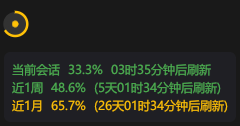

# Coding Plan Widget

[](https://github.com/Shady-Spadez/code-plan-usage/actions/workflows/ci.yml)
[](LICENSE)

桌面悬浮小部件，显示[火山引擎 CodePlan](https://www.volcengine.com/product/codeplan) 用量。



## 功能

- 🖥️ 屏幕悬浮窗，始终置顶，无边框透明背景
- 📊 圆形进度环 + 月度用量百分比
- 🖱️ 鼠标悬停显示三级用量详情与倒计时
- 🔄 每 5 分钟自动刷新（可调）
- ✋ 可拖拽移动，位置持久化
- 🔐 WebView2 弹窗登录获取凭证
- 📋 系统托盘（显示/隐藏、刷新、退出）
- 🚀 可选开机自启 | 🔔 用量阈值通知 | 🎨 亮/暗主题 | 📐 三种尺寸 | 🌐 多区域

### 颜色规则

| 颜色 | 用量范围 |
|------|----------|
| 🟢 绿色 | < 50% |
| 🟡 黄色 | 50% ~ 80% |
| 🟠 橙色 | 80% ~ 95% |
| 🔴 红色 | > 95% |

## 快速开始

```bash
cargo build --release
./target/release/coding-plan-widget.exe
```

右键悬浮窗或托盘图标退出。

## 凭证获取

1. **WebView2 登录（推荐）**：启动时弹出登录窗口，自动获取凭证。
2. **Cookie 文件导入**：将 Netscape 格式 Cookie 文件 `console.volcengine.com_cookies.txt` 放在 exe 同目录。
3. **手动配置**：编辑 `coding_plan_settings.json`，填入 `cookie` 和 `csrf_token`。

## 设置

右键悬浮窗 → 设置，可配置：

| 设置项 | 类型 | 默认值 | 说明 |
|--------|------|--------|------|
| `cookie` | string | `""` | 登录 Cookie |
| `csrf_token` | string | `""` | CSRF Token |
| `region` | string | `"cn-beijing"` | API 区域 |
| `refresh_interval_secs` | number | `300` | 刷新间隔（秒） |
| `notification_threshold` | number | `0.0` | 用量通知阈值（0 关闭） |
| `theme` | string | `"Dark"` | 主题：`Dark` / `Light` |
| `widget_size` | string | `"Medium"` | 尺寸：`Small` / `Medium` / `Large` |
| `auto_start` | bool | `false` | 开机自启 |
| `show_percentage` | bool | `false` | 是否显示百分比数字 |

## 技术栈

[egui](https://github.com/emilk/egui) · [ureq](https://github.com/algesten/ureq) · [serde](https://serde.rs/) · [chrono](https://github.com/chronotope/chrono) · [webview2-com](https://github.com/nicedoc/webview2-com) · [tray-icon](https://github.com/tauri-apps/tray-icon)

## 开发

```bash
cargo test                        # 运行测试
cargo build --release             # 构建
cd installer && build.bat         # 构建 MSI 安装包（需 WiX Toolset）
```

## 许可证

[MIT](LICENSE)
